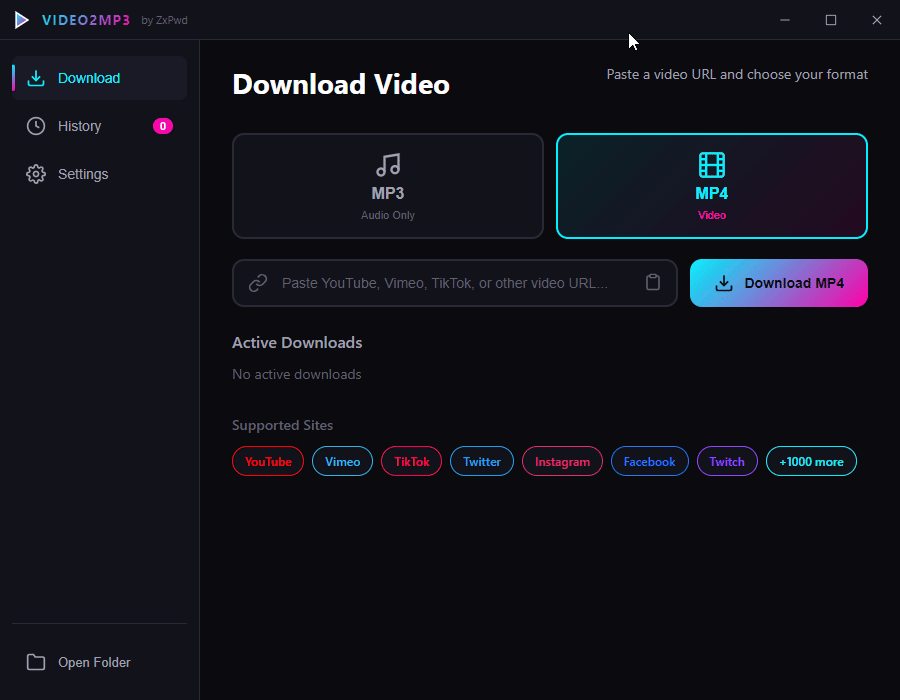

# Video2MP3

<p align="center">
  
</p>

<p align="center">
  <strong>A sleek, standalone desktop application to download videos and convert them to MP3 or MP4</strong>
</p>

<p align="center">
  
  
  
  
</p>

---

## Preview

<p align="center">
  
</p>

---

## Features

- **Multi-Platform Support** - Download from YouTube, TikTok, Vimeo, Twitter/X, Instagram, Facebook, Twitch, SoundCloud, and 1000+ more sites
- **Format Selection** - Choose between MP3 (audio) or MP4 (video) with a simple toggle
- **Quality Options** - Select audio bitrate (128/192/256/320 kbps) or video quality (480p/720p/1080p/Best)
- **Download History** - Track all your downloads with platform tags and status indicators
- **Modern Cyberpunk UI** - Sleek dark theme with cyan and magenta accents
- **Portable Application** - No installation required, just run the executable
- **No Dependencies** - Bundled with yt-dlp and ffmpeg, no external software needed
- **System Tray Support** - Minimize to tray for background operation
- **Video Splash Screen** - Custom intro video on startup (can be disabled in settings)
- **Real-time Progress** - Visual progress bars for downloading and converting

---

## Download

Download the latest portable executable from the [Releases](https://github.com/ZxPwdz/Video2MP3/releases) page.

---

## Usage

1. **Launch** the application (Video2MP3-Portable.exe)
2. **Paste** a video URL from any supported platform
3. **Select** your preferred format (MP3 or MP4)
4. **Click** Download and watch the progress
5. **Find** your files in the Downloads/Video2MP3 folder (or customize in Settings)

---

## Supported Platforms

| Platform | Status |
|----------|--------|
| YouTube | Supported |
| TikTok | Supported |
| Vimeo | Supported |
| Twitter/X | Supported |
| Instagram | Supported |
| Facebook | Supported |
| Twitch | Supported |
| SoundCloud | Supported |
| Dailymotion | Supported |
| Reddit | Supported |
| Bilibili | Supported |
| And 1000+ more... | Supported |

---

## Settings

- **Output Directory** - Choose where to save downloaded files
- **Download Format** - Default format (MP3/MP4)
- **Audio Quality** - 128, 192, 256, or 320 kbps
- **Video Quality** - 480p, 720p, 1080p, or Best available
- **Minimize to Tray** - Keep running in system tray when closed
- **Show Intro Video** - Toggle the splash screen video on startup

---

## Building from Source

### Prerequisites

- Node.js 18+
- npm or yarn

### Steps

```bash
# Clone the repository
git clone https://github.com/ZxPwdz/Video2MP3.git
cd Video2MP3

# Install dependencies
npm install

# Run in development mode
npm start

# Build portable executable
npm run build
```

### Bundled Binaries

The `bin/` folder should contain:
- `yt-dlp.exe` - Video downloader
- `ffmpeg.exe` - Audio/video converter

Download these from their official sources:
- [yt-dlp](https://github.com/yt-dlp/yt-dlp/releases)
- [ffmpeg](https://ffmpeg.org/download.html)

---

## Tech Stack

- **Electron** - Cross-platform desktop framework
- **yt-dlp** - Video downloading engine
- **ffmpeg** - Audio/video conversion
- **electron-store** - Persistent settings storage
- **electron-builder** - Application packaging

---

## License

This project is licensed under the MIT License - see the [LICENSE](LICENSE) file for details.

---

## Credits

**Developed by [ZxPwd](https://github.com/ZxPwdz)**

---

## Disclaimer

This tool is intended for downloading videos that you have the right to download. Please respect copyright laws and the terms of service of the platforms you use. The developers are not responsible for any misuse of this software.
